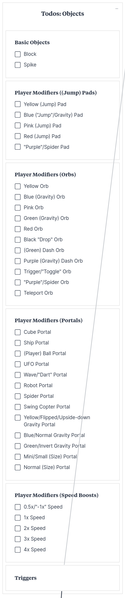

# Anga Dash **_(Reborn)_** Official Source Code Guide

Welcome to the Anga Dash Reborn official source code guide! Get ready to read an essay on the source code itself cuz this is gonna be **LONG**

## Chapter 0: Requirements

Games like this are made with [HaxeFlixel](https://haxeflixel.com) where the main package is `flixel`

### Section 0: [Haxe](https://haxe.org)

Flixel games are usually made with Haxe

That's all there is to it

### Section 1: Dependencies

- flixel (5.3.1)
- flixel-ui (2.5.0)
- hscript (2.5.0)
- lime (8.0.2)
- openfl (9.2.2)
- tjson (1.4.0)

### Section 2: Software and more

1. Haxe (4.3.1)
2. hxcpp
3. A coding IDE
   1. Visual Studio Code
   2. HaxeDevelop/~~FlashDevelop~~
4. A brain

### Section 3: Why?

- flixel: The engine the game uses
- hscript: _shrug_
- lime: The compiler and utility engine the game uses
- openfl: The graphics engine flixel uses
- tjson: The JSON loader (mainly used for song metadata)
- Haxe: The language used to write the game
- hxcpp: The Haxe to C++ thing (used by windows builds)
- A coding IDE: What you use to use the language!
- A brain: What you use everyday

### Section 4: How?

4/10 (40%) of these are easy to figure out. As for the other 60%... It's complicated

- A brain: I won't kid myself here, everyone who isn't a zombie has one.
- A coding IDE: I have two recommendations
  1. Visual Studio Code (AKA VS Code/VSC/[VSC Geometry Dash/VSC GD](https://www.youtube.com/watch?v=ewlMbTR-c_w&pp=ygUGdnNjIGdk))
     - The game's IDE!
     - The chosen one of all IDEs!
     - Forked by a site that "accidentally" banned me...
     - The least used Python IDE (personally)!
     - The best multilingual IDE (Both nationally and codingly speaking)!
     - A based IDE that doesn't trap you inside of it (unlike Virtualy Impolite Machine)!
     - Also: Personaly my favorite IDE, and, objectively, the best one! _Vine Boom_
     - ([Reference for what I've done here](https://www.youtube.com/watch?v=IN8j13UGSBo))
  2. HaxeDevelop (Formerly FlashDevelop)
     - ... --- .-.-.- .-.-.- .-.-.-
     - -. --- - .... .. -. --. ..--.. --- -.-
  3. I don't recommend any other IDE for Haxe
- hxcpp: It comes with Haxe, but requires C++. You can get it by getting VS 2022 with C++ desktop developement ticked
- Haxe: Go to [Haxe's official website](https://haxe.org) and download the exact version (4.3.1). PS: There's something called `haxelib` that also comes with Haxe. So you can `install` the following dependencies
- flixel: Go to your terminal and type `haxelib install flixel 5.3.1`
- flixel-ui: Go to your terminal and type `haxelib install flixel-ui 2.5.0`
- hscript: Go to your terminal and type `haxelib install hscript 2.5.0`
- lime: Go to your terminal and type `haxelib install lime 8.0.2`
- openfl: Go to your terminal and type `haxelib install openfl 9.2.2`
- tjson: Go to your terminal and type `haxelib install tjson 1.4.0`

### Section $4+i$: Aquired what's required

Get moddin'! Happy moddin', reader of this document!

## Chapter 1: Adding Objects in `ObjectGD.hx` and `Cube.hx`

In Anga Dash Reborn (ADR) the way to add it is similar to the original. Just now, the level editor is being implemented

PS:



Anyway, back to objecting

### Section 0: OG Anga Dash Version Recap

Ugh! Who am I kidding? I forgot

### Section $i$: Texture

Ugh! Who am I kidding? It's determined automatically

### Section 1: Hitbox

Firstly, you'll need to find the following piece of code:

```haxe
// Defining the object's hitbox
switch (id)
{
    // ...
    default:
        hitbox = new Hitbox(0, 0, 60, 60);
}
```

> Note: The `// ...` accounts for newer objects

Add this snippet **_DIRECTLY_** before the `default`

```haxe
case id:
    hitbox = new Hitbox(xoff, yoff, width, height);
```

> Quick note: Getting `xoff`, `yoff`, `width` and `height` does not require any trial and error for me. Here's how: Open up your image editor and select the part of it you want to be its hitbox
> Look at the bottom info

### Section 2: Player Interaction

How do you think your object should interact with the player? After you've thought of that, go to `Cube.hx` where you'll find the `updateObjCollision` method in the main class

Firstly, find this piece of code:

```haxe
for (obj in PlayState.level.level)
{
    // Ignore this
    /* FlxG.overlap(this, obj.hitbox, function objectCollision(_a:FlxBasic, _b:FlxBasic)
        {
            switch (obj.id)
            {
                case 0:
                    final maxDist:FlxPoint = FlxPoint.get(0, 10); // maxDist.x is not used
                    var oldPos:FlxPoint = getPosition();
                    if (gameType == PLAT)
                        FlxObject.separate(this, obj.hitbox);
                    var dist:FlxPoint = oldPos - getPosition();
                    if (gameType == PLAT)
                    {
                        // else
                        grounded = true;
                        if (dist.x != 0)
                            dirf2 = dir2 = 0;
                        FlxG.collide(this, obj.hitbox);
                        grounded = true;
                        velocity.x = velocity.y = 0;
                        /* for (i in 0...60)
                            {
                                y--;
                        }*
                        if (dist.x == 0)
                        {
                            // y--;
                            // y -= 60;
                        }
                        else
                        {
                            // x += (obj.x - x) / Math.abs(obj.x - x);
                            // x += (obj.width - (obj.x - x)) / 2;
                        }
                        // if (FlxG.overlap(this, obj.hitbox))
                        //  setPosition(x, oldPos.y);
                        FlxObject.separate(this, obj.hitbox);
                        return;
                    }
                    if (dist.x != 0 || Math.abs(dist.y) > Math.abs(maxDist.y))
                    {
                        setPosition(oldPos.x, oldPos.y);
                        PlayState.reset();
                    }
                default:
                    trace('Not implemented (yet)');
            }
    });*/
    if (FlxG.overlap(this, obj.hitbox))
    {
        switch (obj.id)
        {
            // ...
            default:
                if (obj.id >= 0)
                    trace('Not implemented (yet)');
        }
    }
}
```

Add this snippet of code before the `default`:

```haxe
case id:
    // logic
```

> Quick note: I will NOT give a crash course in HaxeFlixel or Haxe in general, so high level Haxe & HaxeFlixel understanding and experience is also required
> If you don't have experience yet, please look at the docs/API on [Haxe's official webste](https://haxe.org) and [HaxeFlixel's official website](https://haxeflixel.com)
